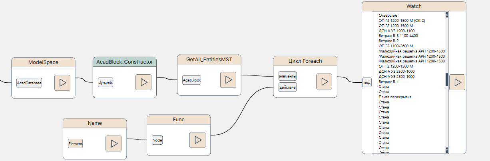

# Руководство пользователя по пакету нодов NVP_ModelStudio_COM

Обращаем внимание, что настоящий пакет должен использоваться совместно с NVP_nanoCAD_COM. 

**Примечание**: Для релизов ModelStudio CS на AutoCAD (декабрь 2023 и старше) настоящий пакет не применим. Необходимо создание пакета для AutoCAD, либо перенос логики выбора приложения и объектов на сторону Python-скрипта.

Все приводимые ниже фрагменты нодов см. в файле `NVP_MCT_COM_Sample_Explore objects.nvproj` из папки samples/nanoCAD.

# Понятие объекта ModelStudio CS

В [справочоном руководство по NVP_nanoCAD_COM](./UserGuide_ncad.md) мы упоминали, что все объекты вертикальных приложений на платформе nanoCAD доступны в виде сущностей `AcadEntity`. Отличительный признак всех объектов ModelStudio CS -- это возможность приведения объекта платформы nanoCAD к интерфейсу **mdsUnitsLib.IMDSParametricEnt** (равно как и попытка получить у `AcadEntity` свойство **Element**). 

Для облегчения выбора объектов только ModelStudio имеется метод GetAll_EntitiesMST в mdsUnitsLib.Selection для данного AcadBlock.

Рассмотрим выборку объектов модели для MST Строительные решения:

Здесь мы как раз применили метод GetAll_EntitiesMST, который нам вернул набор объектов MST в виде mdsUnitsLib.MDSParametricEnt, у которых мы запросили свойство Name -- Имя.

Каждый объект ModelStudio имеет свойство Element, возвращающее его набор параметров. При этом у объекта могут быть как родительские, так и дочерние связи (для каждого из объектов которых есть свои наборы параметров).
