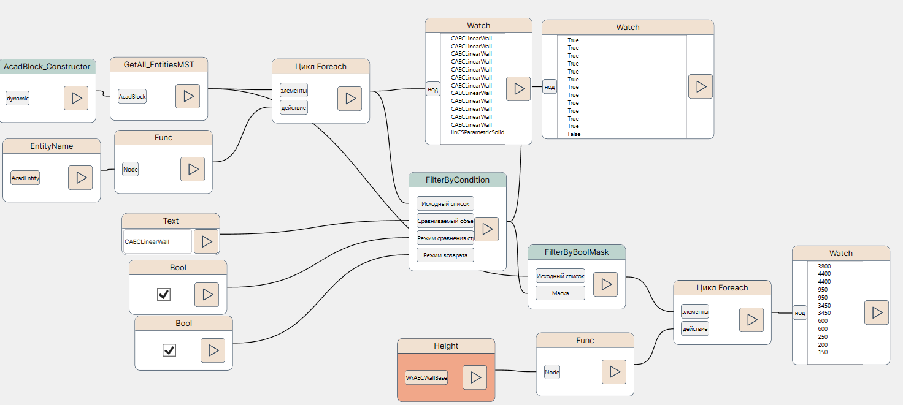

# Руководство пользователя по пакету нодов NVP_ModelStudio_COM

Обращаем внимание, что настоящий пакет должен использоваться совместно с NVP_nanoCAD_COM. 

**Примечание**: Для релизов ModelStudio CS на AutoCAD (декабрь 2023 и старше) настоящий пакет не применим. Необходимо создание пакета для AutoCAD, либо перенос логики выбора приложения и объектов на сторону Python-скрипта.

Все приводимые ниже фрагменты нодов см. в файле `NVP_MST_COM_Sample_Explore objects.nvproj` из папки samples/nanoCAD.

## Понятие объекта ModelStudio CS

В [справочоном руководство по NVP_nanoCAD_COM](./UserGuide_ncad.md) мы упоминали, что все объекты вертикальных приложений на платформе nanoCAD доступны в виде сущностей `AcadEntity`. Отличительный признак всех объектов ModelStudio CS -- это возможность получить у `AcadEntity` свойство **Element**. 

Для облегчения выбора объектов только ModelStudio имеется метод GetAll_EntitiesMST2 в mdsUnitsLib.Selection для данного AcadBlock.

**Примечание**: существует также метод **GetAll_EntitiesMST** в группе AcadBlock. Он возвращает те же объекты, только представленные как `AcadEntity.` Это может быть полезно при попытках привести объект к целевому классу.

Рассмотрим выборку объектов модели для MST Строительные решения:

Здесь мы как раз применили метод **GetAll_EntitiesMST**, который нам вернул набор объектов MST в виде **mdsUnitsLib.Element**, у которых мы запросили свойство Name -- Имя.

Каждый объект ModelStudio имеет свойство Element, возвращающее его набор параметров. При этом у объекта могут быть как родительский (0-1 шт) объект, так и дочерние (0 - несколько), для каждого из которых будет свой набор параметров (и соответственно для каждого из дочерних могут быть свои вложенные элементы). Для запроса всех параметров можно воспользоваться методом GetAll_Parameters, как показано выше.

## Работа с определенными объектами ModelStudio CS

Для работы с объектами ModelStudio CS определенных классов (с расширенными специальными методами для них) необходимо воспользоваться нодом **GetAll_EntitiesMST** из группы AcadBlock и отфильтровать список по нужному типу. Например, попробуем для модели из MST Строительные решения выделить все прямолинейные стены (описываются классом **WrAECLinearWall** и имеет тип AcadEntity.EntitiName = CAECLinearWall). Воспользуемся вспогательными нодами FilterByCondition и FilterByBoolMask из числа вспомогательных нодов NVP_COM_Common.List:

Здесь мы сделали выборку из объектов, вытащили наши прямолинейные стены и применили к ним свойство **Height** (из группы нодов WrAECWallBase), чтобы узнать высоту стен.

Здесь мы проигнорировали приведение полученных объектов `AcadEntity` к классу **WrAECWallBase**, а сразу вызвали целевое свойство **Height** у `AcadEntity`. В принципе, так тоже можно делать.
