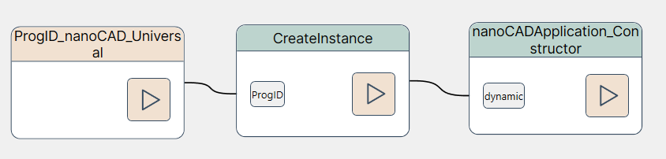
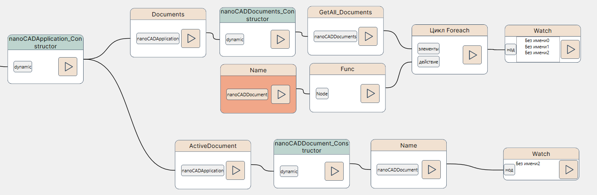
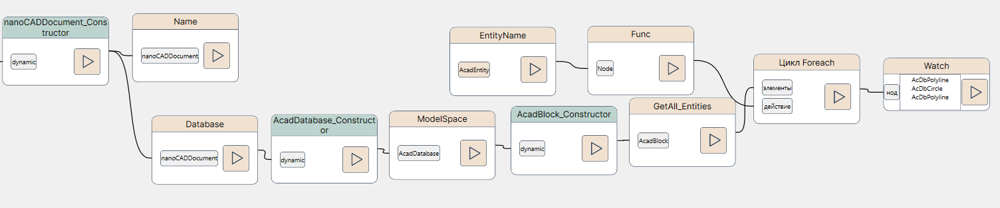
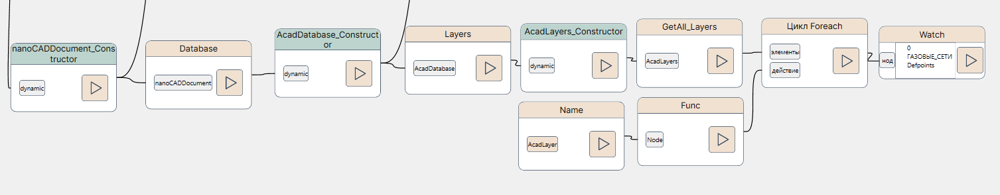
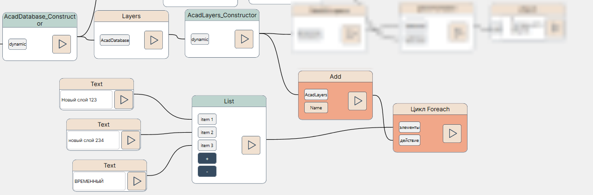
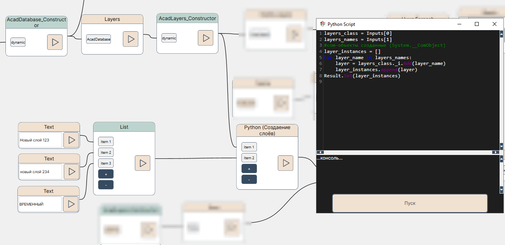
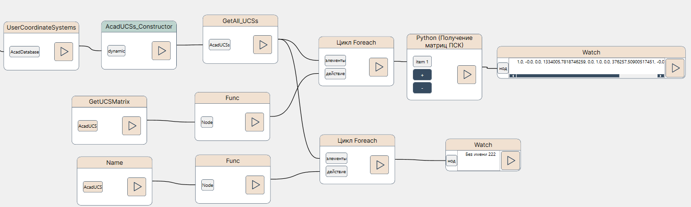
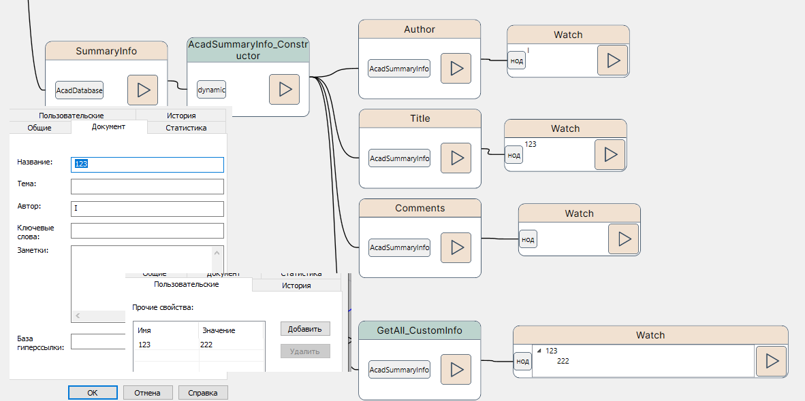

# Руководство пользователя по пакету нодов NVP_nanoCAD_COM

Для понимания логики взаимодествия с nanoCAD необходимо в общих чертах представляет его объектную модель. Для помощи можно воспользоваться справочным руководством <u>ncX_app.chm</u> из состава SDK платформы nanoCAD.

Пользователям, знакомым с объектной моделью AutoCAD, можно просто перенести все знания на nanoCAD.

Все приводимые ниже фрагменты нодов см. в файле `NVP_NCAD_COM_Sample_Explore document.nvproj` из папки samples/nanoCAD.

## Приложение и документы

Приложение nanoCAD (описывается группой нодов `nanoCAD.Application`), в котором может быть открыты один или несколько документов (`группа nanoCAD.nanoCADDocument`).

Для получения объекта приложения nanoCAD необходимо воспользоваться, как и для остальных COM-приложений, нодами из группы `NVP_COM_Commom.ProgIds`, затем подвести к ним нод `NVP_COM_Commom.Common.CreateInstance` и нод `nanoCAD.nanoCADApplication._nanoCADApplication_Constructor`:



Для получения документов и активного документа соответственно набор нодов будет выглядеть так:



Коллекция открытых документов получается через свойство **Documents** в виде `nanoCAD.nanoCADDocuments`, а текущий активный документ свойством **ActiveDocument** в виде `nanoCAD.nanoCADDocument`. Для перебора коллекции документов использован пользовательский нод (есть в составе пакета) `Get_All_Documents` возвращаюший список "классов" документов (если бы к каждому документу был применен нод `_nanoCADApplication_Constructor`). Так как движок NVP в настоящий момент не предназначен для обработки коллекций, то здесь введена функция Name, которая для коллекции возвращает Наименование каждого чертежа.

## Данные документа (чертежа)

В составе каждого документа (чертежа) имеются как объектные (точки, линии, геометрические объекты) данные, так и не-объектные (слои, словари, параметры и свойства документа). Все геометрические объекты имеют тип `AcadEntity`. Группы и словари, например - только `AcadObject`.

### Геометрические данные

Все объекты, созданные в платформе nanoCAD сторонними программами на базе NRX API будут также выражаться через `AcadEntity` и, если для них будет отдельное COM-API, то будут приводиться от `AcadEntity`.

С чертежом неразрывно связано понятие "Блока" -- пространства, где размещены объекты. Пространство модели (ModelSpace), а также каждый из листов (AcadLayout) являются Блоком (AcadBlock); вернее с каждым листом связан свой Блок. Также существуют вхождения блоков (AcadBlockReference) -- например, символы деревьев или меток. Логически принятно разделять определение и вхождения Блоков, которые относятся к объектам чертежа, и отдельно -- сами пространства для работы (модель и листы). Рассмотрим, как получать объекты на Блоке (пространства модели):



Здесь мы работаем с сущностью документа `nanoCAD.nanoCADDocument`, который привели к таковому через нод `_nanoCADApplication_Constructor`. У документа была получена База данных чертежа `AcadDatabase`, приведена к соответствующему типу, у неё получено пространство модели, оно приведено к классу `AcadBlock` и у него вызван пользовательский нод `Get_All_Entities`. Как и в случае с коллекцией документом здесь мы применили обходной путь с циклом, возвращающим наименование класса каждого из AcadEntity (3 шт), которые были в пространстве модели тестового чертежа.

**Примечание**: для выбора сущности чертежа по типу можете воспользоваться нодом `GetAll_EntitiesByName` (для одиночного типа) или `GetAll_EntitiesByNames` (для списка типов), для выбора всех объектов ModelStudioCS -- нодом `GetAll_EntitiesMST`.

#### Создание новых объектов

Почти все (группы, например, не здесь) методы по созданию новых объектов находятся среди методов класса AcadBlock, начинаются они с префикса `Add`. Пример создания окружности и штриховки на её основе можно найти в примере `NVP_NCAD_COM_Sample_Create Circle and Hatch.nvproj`.

TODO:

### Необъектные данные

#### Слои

Доступ к слоям (просмотр и редактирование) осуществляется через AcadLayers, получить объект можно при вызове свойства Layers у AcadDatabase (базы данных чертежа):



С созданием новых слоев сложнее. Так как движок NVP пока не приспособлен под обработку в циклах нодов, которые ожидают > 1 аргумента, то здесь единственным вариантом остается использование альтернативных средств автоматизации, например, Python-нодов.



Так (выше) пока делать нельзя.



При помощи следующего приведенного листинга идет обращение к полю `_i` созданного класса-обёртки вокруг AcadLayers и вызывается метод добавления нового слоя через команду Add. На выходе получается COM-объект слоя, который мы сохраняем и подаем на output нода.

```python
layers_class = Inputs[0]
layers_names = Inputs[1]
#созданные com-объекты (System.__ComObject)
layer_instances = []
for layer_name in layers_names:
    layer = layers_class._i.Add(layer_name)
    layer_instances.append(layer)
Result.Set(layer_instances)
```

#### ПСК

Информация о ПСК также получается из Базы данных чертежа при помощи свойства `UserCoordinateSystems`. Ниже показан пример получения информации обо всех ПСК чертежа:



Здесь при помощи функций и циклов мы получили перечень наименований ПСК в чертеже и при помощи Py-нода строковую запись матрицы трансформации ПСК.

#### Информация о документе

В DWG имеются так называемые свойства чертежа, со стороны UI они доступны на вкладах Общие и Пользовательские при вызове команды `DWGPROPS`.

Со стороны нодов доступ к ним осуществляется при помощи группы нодов `SummaryInfo`:



Здесь используется пользовательский нод `GetAll_CustomInfo` для получения информации обо всех дополнительных свойствах в виде словаря. Для регистрации\перезаписи свойств можно использовать нод `Add_GroupOfCustomInfo`.
