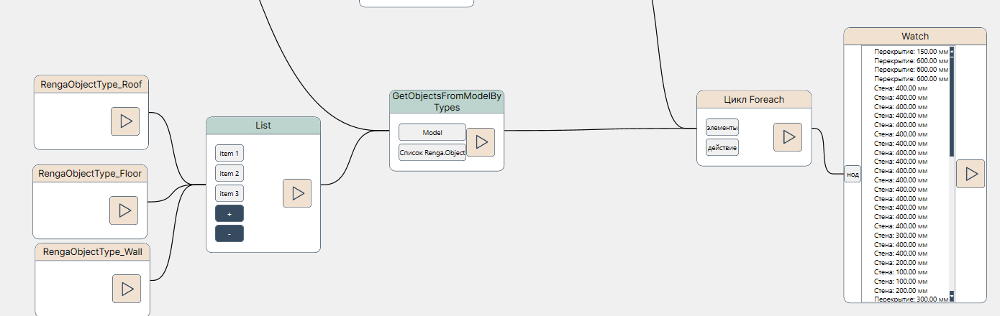

# Руководство пользователя по пакету нодов NVP_Renga_COM

Возможности Renga COM API ограничены следующими действиями:

* Создание, редактирование, получение объектных свойств;

* Получение расчетных свойств и параметров объектов;

* Перебор объектов модели (получение их свойств, геометрии приведенной к Mesh-виду и в ряде мест выраженной осями), привязка объектов к уровням, приведение объектов к некоторым интерфейсам для получения расширенных методов запроса информации (например, к типу Окна);

* Доступ к функциям формирования скриншотов с модели, к выгрузке свойств в csv и имеющихся чертежей в графические форматы;

* Перехват и задание выбора объектов в модели, управление видимостью объектов;

Отдельно отметим, что Renga API **не предоставляет** возможности создания новых геометрических объектов (только операция их копирования и размещения копии в модели для некоторых категорий объектов).

Рассмотрим далее примеры взаимодействия с Renga

## Получение приложения и модели

Ниже представлен набор нодов, который осуществляет подключение к текущему приложению Renga и проекту в нём:

Здесь используется постоянная конструкция, поэтому в составе нодов Application имеется нод ActiveProject, в теле которого "зашита" логика представленных выше 5 нодов. 

## Получение мета-данных модели

К условному понятию мета-данных можно отнести не геометрическую информацию (стили, свойства проекта/участка/здания, набор чертежей и т.д.). Пример получения информации о проекте и его свойствах приведен в файле `NVP_Renga_COM_Sample_Get project info.nvproj`.

## Выборка объектов

Для облегчения выбора объектов в составе набора нодов Selection реализован вспомогательный нод GetObjectsFromModelByClass, принимающий на вход класс Model и один из enum_SelectionType. Возвращает он ноды-конструкторы классов, например, BeamParams_Constructor и т.д.

Также имеются ноды GetObjectsFromModelByType и GetObjectsFromModelByTypes для одиночного и нескольких целевых типов объектов (например, балки или лестницы), возвращающие объект модели ModelObject, приведенный к данному типу через нод ModelObject_Constructor.

Рассмотрим ноды на примере получения информации по всем перекрытиям (FloorParams) и вывода наименований этих перекрытий:

Как можно видеть в нодах Watch последовательность объектов одинаковая (по числовым значениям толщины). При желании получать несколько типов объектов, можно воспользоваться соответствующим нодом:

